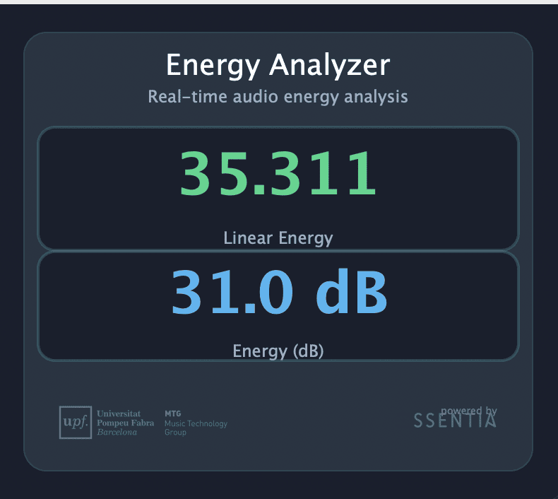
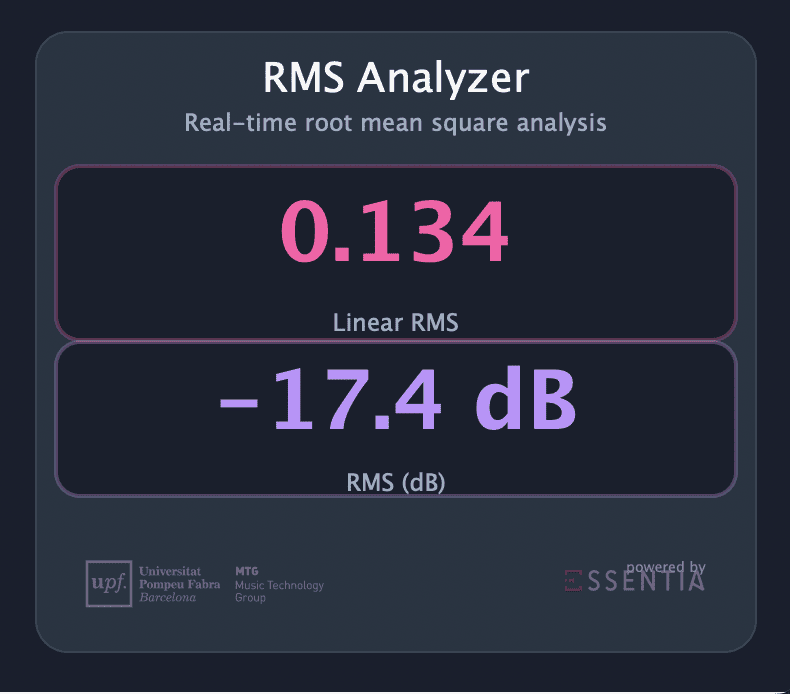
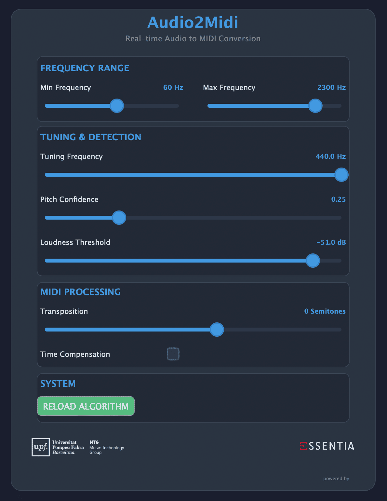
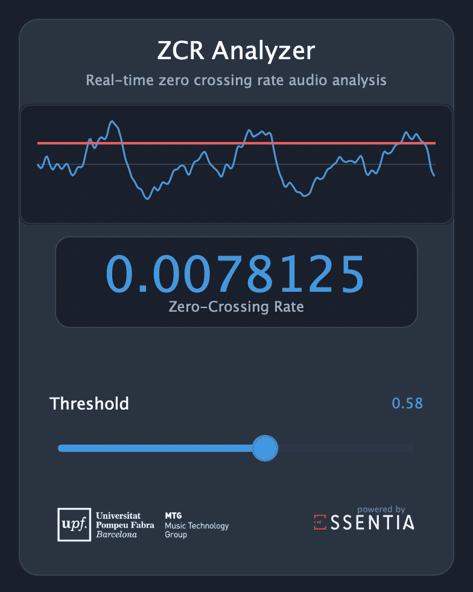

# Essentia‑Plugins

Collection of VST3 audio‑analysis and utility effects built with the **[Essentia](https://essentia.upf.edu/)** DSP library and **[JUCE](https://juce.com/)**.  
The repository ships ready‑to‑use plugins **and** templates so you can bootstrap your own Essentia‑powered processors in minutes.

## Table of Contents
1. [Features](#features)  
2. [Available Plugins](#available-plugins)  
3. [Requirements](#requirements)  
4. [Quick Start](#quick-start)  
5. [Building Essentia](#building-essentia)  
6. [Developer Guide](#developer-guide)  
7. [Plugin Templates](#plugin-templates)  
8. [Contributing](#contributing)

## Features
- **Pre‑built analysis effects**: RMS, Energy, Audio2MIDI and more  
- **Cross‑platform** JUCE + Essentia stack (macOS, Windows 10+, Linux)  
- **CMake *or* Projucer** build flows  
- **Self‑contained static Essentia** build—no runtime dependencies  
- **Starter templates** to create new plugins quickly

## Available Plugins

| Plugin name    | Description                                        | Build system |
|----------------|----------------------------------------------------|--------------|
| **RMS**        | Sample‑accurate root‑mean‑square meter             | CMake & Projucer |
| **Energy**     | Frame‑based energy estimator                       | CMake        |
| **Audio2Midi** | Monophonic pitch tracker that outputs MIDI events  | CMake & Projucer |
| **ZeroCrossingRate** | Calculates zero crossing rate for audio analysis | CMake      |

<table>
  <tr>
    <td align="center">
      
      <br><b>Energy</b>
    </td>
    <td align="center">
      
      <br><b>RMS</b>
    </td>
  </tr>
  <tr>
    <td align="center">
      
      <br><b>Audio2Midi</b>
    </td>
    <td align="center">
      
      <br><b>Zero Crossing Rate</b>
    </td>
  </tr>
</table>

---

## Requirements
- **CMake** >= 3.22
- **Python** >= 3.8
- **JUCE** 8.x
- **Essentia** `1f486843` (built as *static* library)
- **GoogleTest** *optional* (unit‑tests for plugins)

## Quick Start

```bash
# 1. Clone with submodules
git clone --recurse-submodules https://github.com/MTG/essentia-plugins.git
cd essentia-plugins

# 2. Build dependencies (JUCE, Essentia, ...)
bash scripts/build-external.sh      # build_external/

# 3. Build Essentia (static) with waf
bash scripts/build-essentia-osx.sh  # or build-essentia-linux.sh / .bat

# 4. Build every plugin
mkdir build && cd build
cmake .. -DCMAKE_PREFIX_PATH="${PWD}/../build_external/install" -DCOPY_PLUGIN_AFTER_BUILD=ON
cmake --build . --parallel
```

> If `COPY_PLUGIN_AFTER_BUILD` is `ON`, the resulting `.vst3` is copied automatically to the user plugin folder  
> (e.g. `~/Library/Audio/Plug‑Ins/VST3` on macOS).

### Custom CMake options

| Variable                    | Default | Description                                                               |
|-----------------------------|---------|---------------------------------------------------------------------------|
| `COPY_PLUGIN_AFTER_BUILD`   | `OFF`   | Automatically install the plugin after every successful build             |
| `CUSTOM_PLUGIN_INSTALL_DIR` | *(none)*| Override the destination path used when copying the plugin                |
| `PLUGIN_FORMATS`            | `"VST3"` | Semicolon‑list of JUCE plugin formats (e.g. `"VST3;AU"`)               |

---

## External Dependencies Build Process

The `build-external.sh` script handles the building of all external dependencies required by the project (JUCE, GoogleTest). Here's what it does:

```bash
# Create build directory at project root
mkdir -p build_external && cd build_external

# Configure external CMake project 
cmake ../external

# Build all dependencies in parallel
cmake --build . --parallel
```

This process creates the `build_external/install` directory that contains:
- JUCE modules and CMake integration
- GoogleTest library for unit testing
- Installation target for the Essentia library (populated in the next step)


## Building Essentia

Essentia’s official CMake support is *in progress*; therefore the recommended path is its native **waf** build, which bundles all dependencies into one static library:

```bash
cd external/essentia
python3 waf configure --build-static --static-dependencies \
  --lightweight= --out=build \
  --prefix="$(pwd)/../../build_external/install"
python3 waf build -j$(nproc)
python3 waf install
```

> **Heads‑up:** when you run `cmake`, point the search path to your Essentia install:  
> `-DCMAKE_PREFIX_PATH=$(pwd)/../../build_external/install` **or**  
> `-DESSENTIA_ROOT=$(pwd)/../../build_external/install`.

## Developer Guide

For detailed technical information on integrating Essentia algorithms into your JUCE plugins, refer to our comprehensive [Developer Guide](DeveloperGuide.md). The guide includes:

- Step-by-step integration instructions
- Code templates for quick implementation
- Port names and buffer shapes for common algorithms
- Performance tips and best practices
- Examples of real-time audio analysis implementation

This guide is essential for developers wanting to create their own Essentia-powered audio plugins beyond using the templates.

---

## Plugin Templates

| Path                                   | Build system | What you get                                             |
|----------------------------------------|--------------|----------------------------------------------------------|
| `templates/cmake`                      | CMake        | Minimal JUCE + Essentia VST3 with unit tests             |
| `templates/projucer`                   | Projucer     | Same template exported as a `.jucer` project             |

Copy one of the folders, rename it, then adapt `CMakeLists.txt` (or the Projucer settings) to your new product name.

See the [Developer Guide](DeveloperGuide.md) for detailed instructions on implementing Essentia algorithms in your plugins.

---

## Contributing
Pull requests and issue reports are welcome!  
Please read the [CONTRIBUTING](CONTRIBUTING.md) guide before submitting code.
